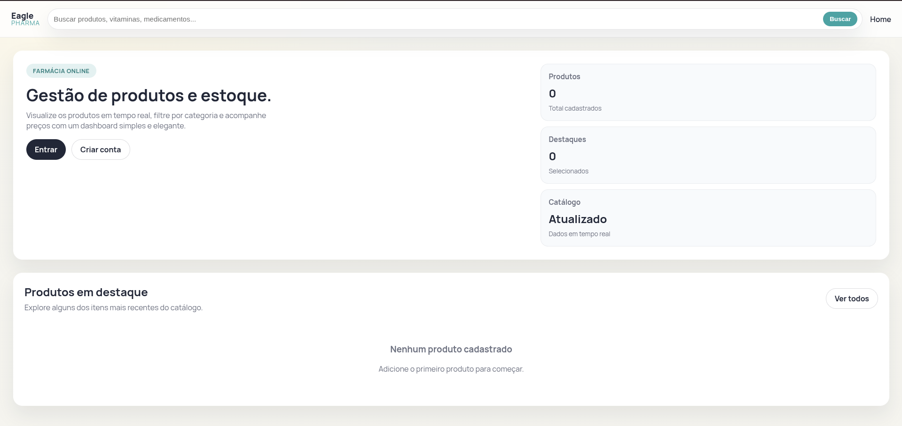
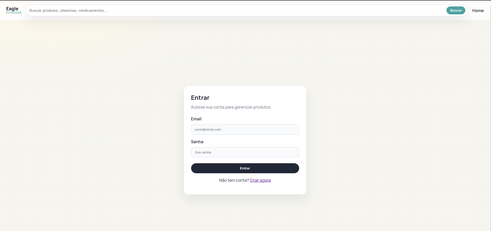
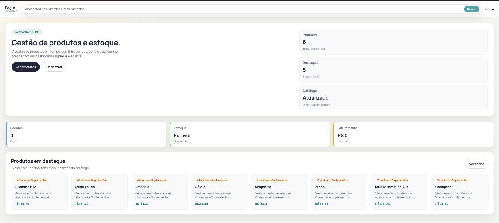
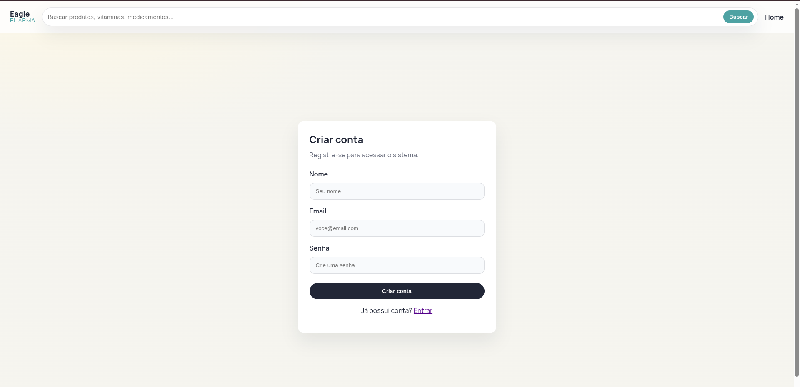
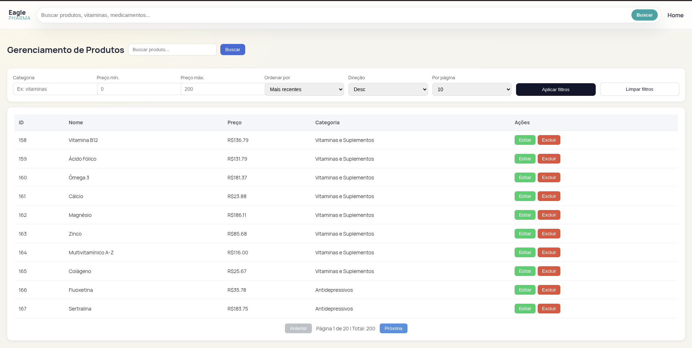
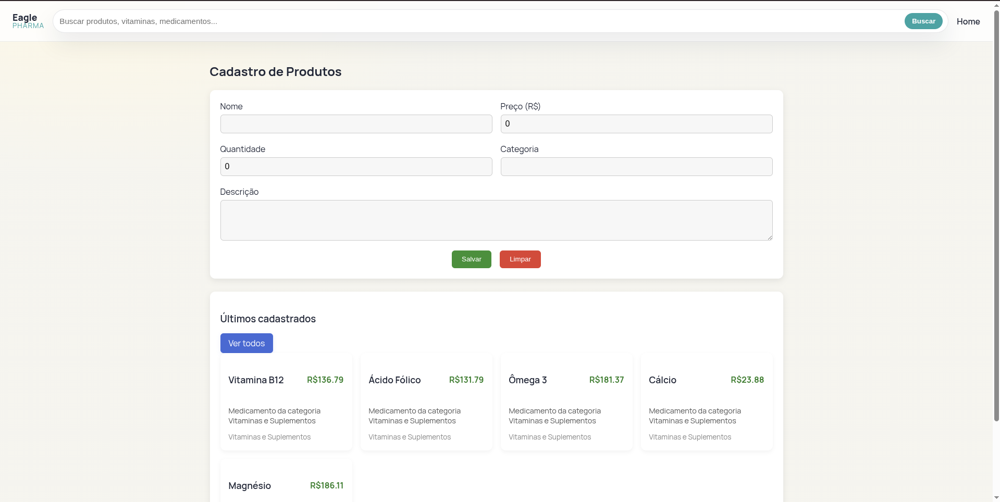

# Eagle Pharma - Farmácia Online

## Como rodar o Projeto:

## Backend (Laravel)
1. Entrar na pasta:
   - `cd backend`
1. Instalar dependências:
   - `composer install`
1. Copiar o `.env`:
   - `cp .env.example .env`
1. Configurar o banco no `.env`:
   - `DB_CONNECTION=mysql`
   - `DB_HOST=127.0.0.1`
   - `DB_PORT=3306`
   - `DB_DATABASE=farmacia`
   - `DB_USERNAME=root`
   - `DB_PASSWORD=`
1. Gerar a chave da aplicação:
   - `php artisan key:generate`
1. Rodar migrations e seed:
   - `php artisan migrate`
   - `php artisan db:seed`
1. Subir a API:
   - `php artisan serve`

Veja se o MySQL está rodando antes de iniciar o backend.

Credenciais de seed:
- Email: `admin@eaglepharma.com`
- Senha: `123456`

## Frontend (Angular)
1. Entrar na pasta:
   - `cd frontend`
1. Instalar dependências:
   - `npm install`
1. Subir o app:
   - `npm start`

Frontend disponível em `http://localhost:4200` e API em `http://localhost:8000`.

## Banco de Dados
O projeto está configurado para MySQL. Ajuste as credenciais no `.env` se necessário e rode:
- `php artisan migrate --seed`

## Screenshots

